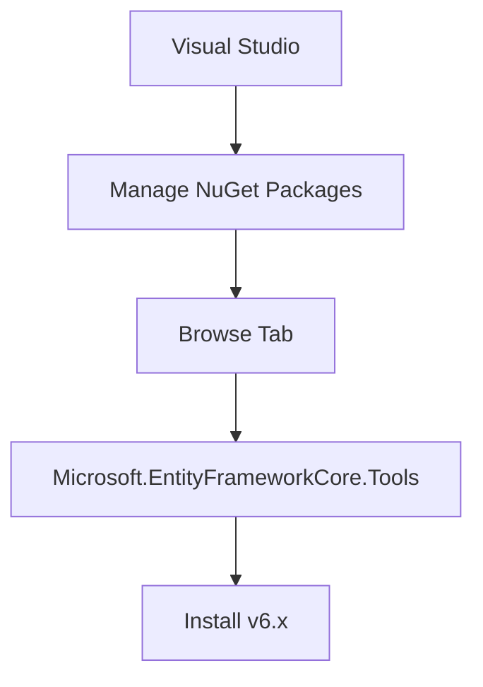
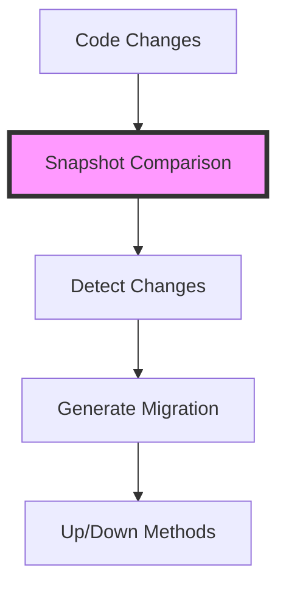
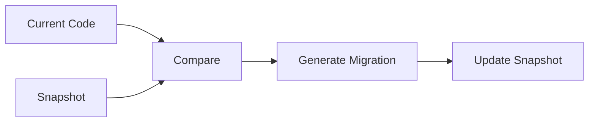

# Entity Framework Core - Database Migrations

## Database Creation Approaches

### 1. EnsureCreated/EnsureDeleted Method
```csharp
using var dbContext = new CompanyDbContext();

// Delete existing database
dbContext.Database.EnsureDeleted();

// Create new database
dbContext.Database.EnsureCreated();
```

#### Limitations
- Deletes entire database
- No change tracking
- Not suitable for production
- Cannot track incremental changes

## Migration System

### Setting Up Migrations

1. **Install Required Package**


#### Package Installation Steps
1. Right-click project
2. Select "Manage NuGet Packages"
3. Go to "Browse" tab
4. Search: `Microsoft.EntityFrameworkCore.Tools`
5. Install version 6.x
6. Accept terms

### Creating Migrations

```powershell
# Package Manager Console command
Add-Migration InitialCreate
```

### Migration Structure

```
ProjectName/
├── Migrations/
│   ├── YYYYMMDDHHMMSS_InitialCreate.cs
│   └── CompanyDbContextModelSnapshot.cs
```

#### Migration Class
```csharp
public partial class InitialCreate : Migration
{
    protected override void Up(MigrationBuilder migrationBuilder)
    {
        // Changes to apply when upgrading
    }

    protected override void Down(MigrationBuilder migrationBuilder)
    {
        // Changes to apply when downgrading
    }
}
```

#### Snapshot Class
- Created with first migration
- Updated with subsequent migrations
- Tracks current model state
- Used for comparison to detect changes



## How Migrations Work

### Change Detection Process


### Migration Components
1. **Up Method**
   - Forward migration
   - Applies changes
   - Creates/modifies tables
   - Adds/removes columns

2. **Down Method**
   - Rollback migration
   - Reverts changes
   - Drops tables
   - Removes modifications

### Best Practices

1. **Migration Naming**
   - Use descriptive names
   - Include purpose
   - Follow naming convention
   - Example: `Add-Migration AddEmployeeSalaryColumn`

2. **Migration Management**
   - Regular migrations for changes
   - Small, focused migrations
   - Test migrations before production
   - Keep migrations in source control

3. **Development Workflow**
   - Make model changes
   - Add migration
   - Review generated code
   - Apply migration
   - Test changes

4. **Production Considerations**
   - Backup database before migration
   - Test migrations in staging
   - Plan for rollback scenarios
   - Monitor migration performance

## Common Scenarios

### Creating Initial Schema
```powershell
Add-Migration InitialCreate
```

### Adding New Properties
```powershell
Add-Migration AddEmployeeEmail
```

### Modifying Existing Schema
```powershell
Add-Migration UpdateEmployeeTable
```

### Rolling Back Changes
```powershell
# Use Package Manager Console
Update-Database LastGoodMigrationName
```
