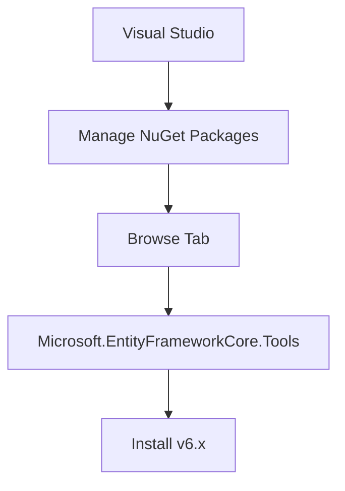
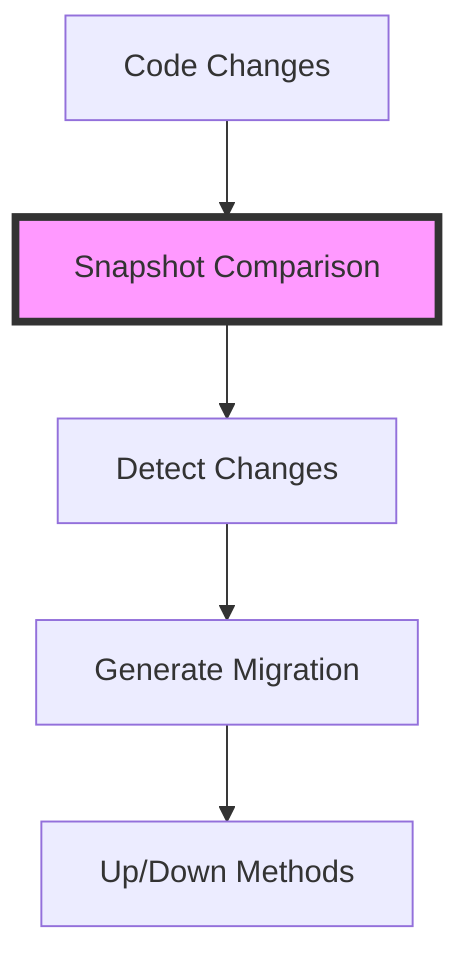
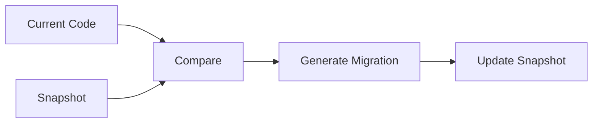
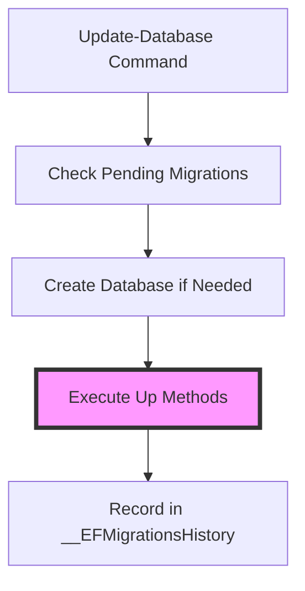
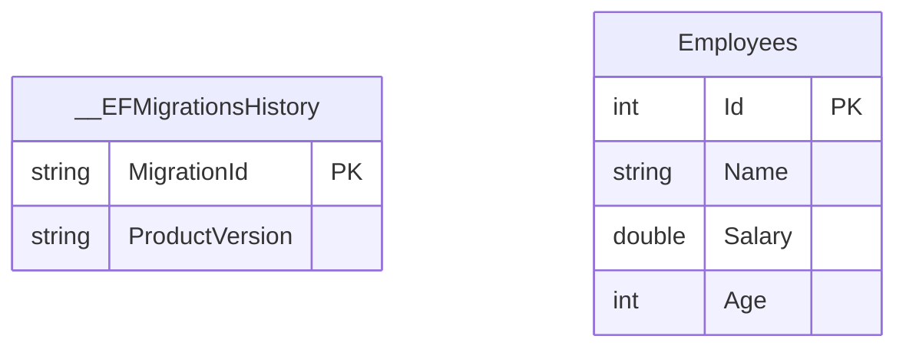

# Entity Framework Core - Database Migrations

## Database Creation Approaches

### 1. EnsureCreated/EnsureDeleted Method
```csharp
using var dbContext = new CompanyDbContext();

// Delete existing database
dbContext.Database.EnsureDeleted();

// Create new database
dbContext.Database.EnsureCreated();
```

#### Limitations
- Deletes entire database
- No change tracking
- Not suitable for production
- Cannot track incremental changes

## Migration System

### Setting Up Migrations

1. **Install Required Package**


#### Package Installation Steps
1. Right-click project
2. Select "Manage NuGet Packages"
3. Go to "Browse" tab
4. Search: `Microsoft.EntityFrameworkCore.Tools`
5. Install version 6.x
6. Accept terms

### Creating Migrations

```powershell
# Package Manager Console command
Add-Migration InitialCreate
```

### Migration Structure

```
ProjectName/
├── Migrations/
│   ├── YYYYMMDDHHMMSS_InitialCreate.cs
│   └── CompanyDbContextModelSnapshot.cs
```

#### Migration Class
```csharp
public partial class InitialCreate : Migration
{
    protected override void Up(MigrationBuilder migrationBuilder)
    {
        // Changes to apply when upgrading
    }

    protected override void Down(MigrationBuilder migrationBuilder)
    {
        // Changes to apply when downgrading
    }
}
```

#### Snapshot Class
- Created with first migration
- Updated with subsequent migrations
- Tracks current model state
- Used for comparison to detect changes



## How Migrations Work

### Change Detection Process


### Migration Components
1. **Up Method**
   - Forward migration
   - Applies changes
   - Creates/modifies tables
   - Adds/removes columns

2. **Down Method**
   - Rollback migration
   - Reverts changes
   - Drops tables
   - Removes modifications

### Best Practices

1. **Migration Naming**
   - Use descriptive names
   - Include purpose
   - Follow naming convention
   - Example: `Add-Migration AddEmployeeSalaryColumn`

2. **Migration Management**
   - Regular migrations for changes
   - Small, focused migrations
   - Test migrations before production
   - Keep migrations in source control

3. **Development Workflow**
   - Make model changes
   - Add migration
   - Review generated code
   - Apply migration
   - Test changes

4. **Production Considerations**
   - Backup database before migration
   - Test migrations in staging
   - Plan for rollback scenarios
   - Monitor migration performance

## Common Scenarios

### Creating Initial Schema
```powershell
Add-Migration InitialCreate
```

### Adding New Properties
```powershell
Add-Migration AddEmployeeEmail
```

### Modifying Existing Schema
```powershell
Add-Migration UpdateEmployeeTable
```

### Rolling Back Changes
```powershell
# Use Package Manager Console
Update-Database LastGoodMigrationName
```


# Entity Framework Core - Migration Execution and Database Management

## Migration Files Structure

```
ProjectName/
├── Migrations/
│   ├── YYYYMMDDHHMMSS_InitialCreate.cs        # Generated migration
│   ├── InitialCreate.CustomLogic.cs           # Custom partial class (optional)
│   └── CompanyDbContextModelSnapshot.cs       # Current model state
```

## Migration Class Structure

```csharp
public partial class InitialCreate : Migration
{
    protected override void Up(MigrationBuilder migrationBuilder)
    {
        // Creates tables only (not database)
        migrationBuilder.CreateTable(
            name: "Employees",
            columns: table => new table
            {
                // Column definitions
            });
    }

    protected override void Down(MigrationBuilder migrationBuilder)
    {
        // Drops tables only (not database)
        migrationBuilder.DropTable(
            name: "Employees");
    }
}
```

## Applying Migrations

### Method 1: Programmatic Approach
```csharp
// In Program.cs
using var dbContext = new CompanyDbContext();
dbContext.Database.Migrate();  // Applies all pending migrations
```

### Method 2: Package Manager Console (Recommended)
```powershell
Update-Database
```



## Database Creation Process

1. **First Migration Execution**
   - EF Core creates database
   - Executes Up method
   - Creates required tables

2. **Subsequent Migrations**
   - Only executes Up method
   - Modifies existing schema
   - Database remains intact

## Generated Database Structure

### System Tables


### 1. __EFMigrationsHistory Table
- Tracks applied migrations
- Contains:
  - MigrationId (Timestamp_MigrationName)
  - ProductVersion (EF Tools version)
- Ensures unique migrations

### 2. Entity Tables
- Generated from entity classes
- Follow defined schema
- Include constraints and relationships

## Monitoring and Debugging

### SQL Server Profiler
- Tracks executed SQL queries
- Shows migration commands
- Useful for development debugging

### Management Studio View
- Verify database creation
- Check table structures
- Monitor migration history

## Best Practices

1. **Migration Management**
   - Use Package Manager Console for migrations
   - Keep migrations small and focused
   - Review generated SQL before applying

2. **Partial Classes**
   - Don't modify generated migration files
   - Use partial classes for custom logic
   - Keep custom logic separate

3. **Version Control**
   - Include migrations in source control
   - Document significant changes
   - Track EF Tools version used

4. **Monitoring**
   - Review migration history
   - Check database schema
   - Validate data integrity

## Common Commands and Operations

```powershell
# Apply all pending migrations
Update-Database

# Roll back to specific migration
Update-Database MigrationName

# Generate SQL script
Script-Migration

# Remove last migration (if not applied)
Remove-Migration
```

## Migration History Table Example
```sql
SELECT MigrationId, ProductVersion
FROM __EFMigrationsHistory
ORDER BY MigrationId
```
